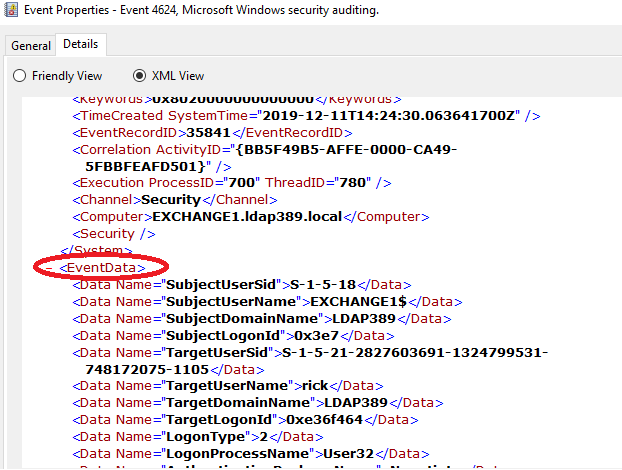

---
# Table of contents:
1. [The ADTimeline PowerShell script](#thescript)
    1. [Description](#description)
    2. [Prerequisites](#prerequisites)
    3. [Usage](#usage)
    4. [Files generated](#files)
    5. [Custom groups](#groups)
2. [The ADTimeline App for Splunk](#theapp)
    1. [Description](#descriptionsplk)
    2. [Sourcetypes](#sourcetype)
    3. [AD General information dashboards](#infradashboards)
    4. [AD threat hunting dashboards](#threathuntdashboards)
    5. [Enhance your traditional event logs threat hunting with ADTimeline](#threathuntevtx)

# The ADTimeline PowerShell script:  <a name="thescript"></a>

## Description: <a name="description"></a>

The ADTimeline script generates a timeline based on Active Directory replication metadata for objects considered of interest.  
Replication metadata gives you the time at which each replicated attribute for a given object was last changed. As a result the timeline of modifications is partial. For each modification of a replicated attribute a version number is incremented.  
ADTimeline was first presented at the [CoRI&IN 2019](https://www.cecyf.fr/activites/recherche-et-developpement/coriin-2019/) (Conférence sur la réponse aux incidents et l’investigation numérique). Slides of the presentation, in french language,  are available [here](https://www.ssi.gouv.fr/publication/investigation-numerique-sur-lannuaire-active-directory-avec-les-metadonnees-de-replication-outil-adtimeline/). It was also presented at the [Amsterdam 2019 FIRST Technical Colloquium](https://www.first.org/events/colloquia/amsterdam2019/program#pActive-Directory-forensics-with-replication-metadata-ADTimeline-tool), slides in english are available [here](https://www.ssi.gouv.fr/en/actualite/adtimeline-active-directory-forensics-with-replication-metadata-at-the-first-technical-colloquium/).

Objects considered of interest retrieved by the script include:

- Schema and configuration partition root objects.
- Domain root and objects located directly under the root.
- Objects having an ACE on the domain root.
- Domain roots located in the AD forest.
- Domain trusts.
- Deleted users (i.e. tombstoned).
- Objects protected by the SDProp process (i.e. AdminCount equals 1).
- The Guest account.
- The AdminSDHolder object.
- Objects having an ACE on the AdminSDHolder object.
- Class Schema objects.
- Existing and deleted Group Policy objects.
- DPAPI secrets.
- Domain controllers (Computer objects, ntdsdsa and server objects).
- DNS zones.
- WMI filters.
- Accounts with suspicious SIDHistory (scope is forest wide).
- Sites.
- Organizational Units.
- Objects with Kerberos delegation enabled.
- Extended rights.
- Schema attributes with particular SearchFlags (Do not audit or confidential).
- Kerberoastable user accounts (SPN value).
- AS-REP roastable accounts (UserAccountControl value).
- Authentication policy silos.
- CertificationAuthority and pKIEnrollmentService objects.
- Cross Reference containers.
- Exchange RBAC roles and accounts assigned to a role.
- Exchange mail flow configuration objects.
- Exchange mailbox databases objects.
- Deleted objects under the configuration partition.
- Dynamic objects.
- The directory service and RID manager objects.
- The Pre Windows 2000 compatible access, Cert publishers, GPO creator owners and DNS Admins groups.
- ADFS DKM containers.
- Service connection point objects considered of interest.
- Custom groups which have to be manually defined.

## Prerequisites: <a name="prerequisites"></a>

- The account launching the script should be able to read objects in the tombstone (Deleted Objects Container) and some parts of the Exchange settings located in the configuration partition (View-Only Organization management). Delegation can be tricky to setup (especially for reading the tombstone). That is why we advise you to run the script with a domain admin account. If you launch the script as a standard user, it will process the timeline without the objects mentioned.
- Computer should run Windows NT 6.1 or later with PowerShell 2.0 or later and have the Active Directory Powershell module installed (part of RSAT-AD-Tools).
- If you enabled PowerShell Constrained Language Mode the script might fail (calling $error.clear()). Consider whitelisting the script via your device guard policy.
- If you are using offline mode install the ADLDS role on your analysis machine in order to use dsamain.exe and mount the NTDS database.

## Usage: <a name="usage"></a>

In online mode no argument is mandatory and the closest global catalog is used for processing. If no global catalog is found run the script with the server argument :
```DOS
PS> .\AD-timeline.ps1 -server <GLOBAL CATALOG FQDN>
```
In offline mode: Replay if necessary transaction logs of the NTDS database, mount it on your analysis machine (ADLDS + RSAT-AD-Tools installed) and use 3266 as LDAP port.
```DOS
C:\Windows\System32> dsamain.exe -dbpath <NTDS.DIT path> -ldapport 3266 -allownonadminaccess
```
If necessary use the allowupgrade switch.

Launch the script targetting localhost on port 3266:
```DOS
PS> .\AD-timeline.ps1 -server "127.0.0.1:3266"
```

## Files generated <a name="files"></a>

Output files are generated in the current directory:

- timeline_%DOMAINFQDN%.csv: The timeline generated with the AD replication metadata of objects retrieved.
- logfile_%DOMAINFQDN%.log: Script log file. You will also find various information on the domain.
- ADobjects_%DOMAINFQDN%.xml: Objects of interest retrieved via LDAP.
- gcADobjects_%DOMAINFQDN%.xml: Objects of interest retrieved via the Global Catalog.


To import files for analysis with powershell. 
```powershell
PS> import-csv timeline_%DOMAINFQDN%.csv -delimiter ";"
PS> import-clixml ADobjects_%DOMAINFQDN%.xml
PS> import-clixml gcADobjects_%DOMAINFQDN%.xml
```
The analysis with the ADTimeline for Splunk is a better solution.

## Custom groups <a name="groups"></a>

If you want to include custom AD groups in the timeline (for example virtualization admin groups, network admins, VIP groups...) use the *Customgroups* parameter.

*Customgroups* parameter can be a string with multiple group comma separated (no space):
```powershell
PS>./ADTimeline -customgroups "VIP-group1,ESX-Admins,Tier1-admins"
```
*Customgroups* parameter can also be an array, in case you import the list from a file (one group per line):
```powershell
PS>$customgroups = get-content customgroups.txt
PS>./ADTimeline -customgroups $customgroups
```
If you do not want to use a parameter you can also uncomment and edit the following array at the  begining of the script:
```powershell
$groupscustom = ("VIP-group1","ESX-Admis","Tier1-admins")
```

# The ADTimeline App for Splunk: <a name="theapp"></a>

## Description: <a name="descriptionsplk"></a>

The ADTimeline application for Splunk processes and analyses the Active Directory data collected by the ADTimeline PowerShell script.

The app's "Getting started" page will give you the instructions for the import process.

Once indexed the dashboards provided by the app will help the DFIR analyst to spot some Acitve Directory persistence mechanisms, misconfigurations, security audit logging bypass, mail exfiltration, brute force attacks ...

The app is also packaged and available on [Splunkbase](https://splunkbase.splunk.com/app/4897/). It has no prerequisite and will work with a [free Splunk](https://docs.splunk.com/Documentation/Splunk/latest/Admin/MoreaboutSplunkFree) license.


## Sourcetypes: <a name="sourcetype"></a>

After processing the ADTimeline script you should have two or three files to import in Splunk (%DOMAINFQDN% is the Active Directory fully qualified domain name):

- timeline_%DOMAINFQDN%.csv: The timeline generated with the AD replication metadata of objects retrieved. The corresponding source type is *adtimeline*.
- ADobjects_%DOMAINFQDN%.xml: Objects of interest retrieved via LDAP. The corresponding sourcetype is *adobjects*.
- gcADobjects_%DOMAINFQDN%.xml: If any, objects of interest retrieved via the Global Catalog. The corresponding source type is *gcobjects*.

### The adtimeline sourcetype:

 The *adtimeline* sourcetype is the data from the timeline_%DOMAINFQDN%.csv file, which is the Active Directory timeline built with replication metadata for objects considered of interest.

The timestamp value is the ftimeLastOriginatingChange value of the replication metadata, which is the time the attribute was last changed, time is UTC.

The extracted fields are:

- Name: LDAP object name.
- pszAttributeName: The attribute name.
- dwVersion: Counter incremented every time the attribute is changed.
- DN: LDAP object DistinguishedName.
- WhenCreated: LDAP object creation time.
- ObjectClass and ObjectCategory: LDAP object type (user, computer, group...)
- SamAccountName and SID: Account Name and security identifier, only applies to users, computers and groups.
- usnOriginatingChange: USN on the originating server at which the last change to this attribute was made.
- pszLastOriginatingDsaDN: DC on which the last change was made to this attribute.
- uuidLastOriginatingDsaInvocationID: ID corresponding to the pszLastOriginatingDsaDN.
- usnLocalChange: USN on the destination server (the server your LDAP bind is made) at which the last change to this attribute was applied.
- Member: Only applies to the group ObjectClass and when the attribute name is member. Contains the value of the group member DistinguishedName.
- ftimeCreated: Only applies to group ObjectClass and when the attribute name is member. Contains the time the member was added in the group.
- ftimeDeleted: Only applies to group ObjectClass and when the attribute name is member. Contains the time the member was removed from the group.

### The adobjects sourcetype:

The *adobjects* sourcetype is the data from the ADobjects_%DOMAINFQDN%.xml file, which is an export of the Active Directory objects considered of interested and retrieved via the LDAP protocol.

The timestamp value is the createTimeStamp attribute value, time zone is specified in the attribute value.

The extracted fields are:

- Name: LDAP object name.
- DN: LDAP object DistinguishedName.
- DisplayName: LDAP object displayname.
- WhenCreated: LDAP object creation time.
- ObjectClass and ObjectCategory: LDAP object type (user, computer, group...)
- SamAccountName and SID: Account Name and security identifier, only applies to users, computers and groups.
- Members and MemberOf: Members of a group ObjectClass can be users, computers or groups and its linked attribute MemberOf which applies to groups, users and computers.
- Owner, AccessToString and SDDL: Are values computed from the nTSecurityDescriptor attribute
- adminCount: Privileged accounts protected by the SDProp process.
- userAccountControl: Attribute which contains a range of flags which define some important basic properties of a computer or user object.
- lastLogonTimestamp: This attribute is not updated with all logon types or at every logon but is replicated and gives you an idea of wether a user or computer account has recently logged on to the domain.
- dNSHostName: DNS hostname attribute of a computer account.
- SPNs: List of Service Principal Names of a computer or user account.

### The gcobjects sourcetype:

The *gcobjects* sourcetype is the data from the gcADobjects_%DOMAINFQDN%.xml file, which is an export of the Active Directory objects within the forest but outside the current domain and considered of interested, those objects are retrieved via the Global Catalog protocol.

The timestamp value is the WhenCreated attribute value, time zone is UTC.

The extracted fields are:

- Name: LDAP object name.
- DN: LDAP object DistinguishedName.
- DisplayName: LDAP object displayname.
- WhenCreated: LDAP object creation time.
- ObjectClass and ObjectCategory: LDAP object type (user, computer, group...)
- SamAccountName and SID: Account Name and security identifier, only applies to users, computers and groups.
- userAccountControl: Attribute which contains a range of flags which define some important basic properties of a computer or user object.
- lastLogonTimestamp: This attribute is not updated with all logon types or at every logon but is replicated and gives you an idea if a user or computer account has recently logged onto the domain.
- dNSHostName: DNS hostname attribute of a computer account.
- SPNs: List of Service Principal Names of a computer or user account.

## AD General information dashboards: <a name="infradashboards"></a>

### The Active Directory Infrastructure dashboard:

This dashboard analyses Adtimeline data in order to create some panels giving you information on the Windows domain infrastructure.

The different panels are:

- General information: Information about the Schema version and functional levels. Depending on the result some AD security features may or may not be available. The Domain Controllers are also listed in this panel
- Microsoft infrastructure products: Tells you if some important Microsoft Infrastructure components such as Exchange on premises, Active Directory Federation Services or Active Directory Certificate Services are installed. Please consider monitoring events related to those services (MSExchange CmdletLogs, ADFS auditing...)
- Domain Trusts: List domain trusts by type and direction. Run ADTimeline on all your trusted domains, but most importantly make sure they are audited, monitored and secured as rigorously as the domain you are analyzing.
- ADDS security features: Tells you if some security features are enabled or not. First feature is the AD Recycle bin which gives the administrator the ability to easily recover deleted objects, it will also change the time after an object is removed from the AD database after deletion. Second feature tells you if the schema extension for the Local Admin Password Solution was performed, if yes sysadmins can enable password randomization for local administrators accounts in order to mitigate lateral movement. Another feature is authentication silos which can help to restrict privileged user account logons in order to mitigate privilege escalation by implementing a tiered administrative model. The last feature is the Protected Users group, with a DFL 2012R2 or more the members of this group receive some additional hardening
- Service Connection Points: Inventory of serviceConnectionPoint (SCP) object class. SCP make it easy for a service to publish service-specific data in the directory Clients of the service use the data in an SCP to locate an instance of the service. Infrastructure assets such as RDS Gateway, SCCM, VMWare Vcenter, some Backup solutions publish an SCP in the directory.
- Active Directory infrastructure timeline: Displays a timeline of the infrastructure changes listed above. This timeline tells you the story of the evolution of your infrastructure.

### The sensitive accounts dashboard:

This dashboard provides an inventory of the privileged accounts in the domain and accounts prone to common attack scenarios due to their configuration.

 The different panels are:

- Admin Accounts: This panel lists the accounts where the Admincount attribute value equals 1. Those accounts have their ACL protected by the SDProp process and it means the account has or had at some point high privileges in Active Directory. The first table lists them and provides some information about the accounts, the second table displays a timeline of modifications for some attributes of these accounts.
- Accounts sensitive to Kerberoast attacks: Kerberoasting is an attack method that allows an attacker to crack the passwords of service accounts in Active Directory offline. The chart is a ratio of accounts prone to this attack and whether or not they are privileged accounts. The table lists them and provides some information about the accounts. Use least privilege principle for those accounts and consider using Group Managed Service Accounts.
- Accounts sensitive to AS-REP Roast attacks: AS-REP Roast is an attack method that allows an attacker to crack the passwords of accounts in Active Directory offline. The chart is a ratio of accounts prone to this attack and whether or not they are privileged accounts. The table lists them and provides some information about the accounts. Use least privilege principle for those accounts.
- Sensitive default accounts: Some general information about the default administrator, guest and krbtgt accounts. Administrator can be disabled or renamed as a measure against account lockout. Guest account must be disabled and krbtgt password should be changed on a regular schedule.
- Accounts trusted for delegation: Kerberos Delegation is a feature that allows an application to reuse the end-user credentials to access resources hosted on a different server. An account trusted for unconstrained delegation is allowed to impersonate almost any user to any service within the network, whereas an account trusted for constrained delegation is allowed to impersonate almost any user for a given service within the network. The chart is a ratio of accounts trusted for constrained/unconstrained delegation. The tables list those accounts, the service name is given for accounts trusted for constrained delegation. A table listing objects with resource based constrained delegation configured is also displayed

## AD threat hunting dashboards: <a name="threathuntdashboards"></a>

### The investigate timeframe dashboard:

Use this dashboard to investigate a particular timeframe.

 The different panels are:

- AD Timeline: A table displaying the timeline for the given timeframe.
- Global stats: Global statistics on modifications occurring during the given timeframe, including modifications by ObjectClass, by pszAttributeName, by Originating DC, by time (i.e. day of the week or hour of the day) and finally stats on deletions by ObjectClass.
- Items created and deleted within timeframe: A table displaying the creations and deletions of the same object within the given timeframe. A first chart gives you stats about object lifetimes in hours and a second one figures by ObjectClass.
- Objects added or removed from groups or ACL modifications within timeframe: This table focuses on the Member and nTSecurityDescriptor attributes, which can help detect an elevation of privilege for a specific account or a backdoor setup by the attacker, the DistinguishedName value of the member and the time the member was added or removed from the group is given in that table. Which makes it more detailed than the above AD Timeline panel. A chart displaying nTSecurityDescriptor modifications by ObjectClass and another displaying the number of times an object was added or removed from a group are given
- GPOs modifications within timeframe: A GPO can used by an attacker in various ways, for example to inject malicious code in logon/startup scripts, deploy malware at scale with an immediate scheduled task, setup a backdoor by modifying the nTSecurityDescriptor... For each attribute modification this table gives you the current client side extensions of the GPO and where the object is linked (OU, site or domain root).

### The track suspicious activity dashboard

This dashboard analyses the Active Directory timeline and highlights some modifications which can be a sign of a suspicious activity, the modifications spoted can also be legitimate and need a triage analysis.

 The different panels are:

- ACL modifications: This panel does not replace a thorough analysis of the Active Directory permissions with tools such as AD Control Paths. The panel contains a graph displaying a weekly timeline of ACL modifications per ObjectClass which occured one year back, some tables are focusing on the domain root and AdminSDHolder objects where permissions can be used as backdoor by an attacker. Finally, some statistics by ObjectClass and by least frequent owners are displayed.
- Accounts: This panel show account modifications which can a be sign of suspicious activity such as users added and removed from groups, some charts provide stats by number of times the account was added or removed, membership time in days, Organizational unit where accounts are located (an account from the "non_privileged_users" OU added and removed from a privileged group can be a sign of suspicious activity). There are some graphs, the first graph shows a timeline of accounts lockouts in order to highlight brute force attacks, the second graph shows SID history editions which can be suspicious outside a domain migration period, the next graph analyses all the different attributes modified on an account during a password change (supplementalCredentials, lmPwdHistory, unicodePwd...) and checks they are modified at the same time. A table displays resource based constrained delegation setup on privileged account or domain controller computer objects, which can be a backdoor setup by an attacker. Finally a chart displays domain controller computer objects password change frequency, an attacker could modify the DC registry to disable computer password change and use this password as a backdoor.
- GPOs: A table of GPOs modifications having an audit client side extension is displayed, an attacker could change the audit settings on the domain to perform malicious actions with stealth. Finally modifications which could result in a GPO processing malfunctioning are displayed, this includes gPCFunctionalityVersion, gPCFileSysPath or versionNumber attribute modification.
- DCshadow detection: The DCshadow is an attack which allows an attacker to push modifications in Active Directory and bypass traditional alerting by installing a fake DC. It was first presented by Vincent Le Toux and Benjamin Delpy at the BlueHat IL 2018 conference. The first graph will try to detect the installation of the fake DC by analyzing server and nTDSDSA ObjectClass. The two following tables will try to detect replication metadata tampering by analyzing usnOriginatingChange and usnLocalChange values which should increment through the time.
- Schema and configuration partition suspicious modifications: The first graph displays Active Directory attribute modifications related to the configuration and schema partitions which can lower the security of the domain, used as backdoor by an attacker or hide information to the security team. The second graph is relevant if you have Exchange on premises and track modifications in the configuration partition which can be a sign of mail exfiltration.

## Enhance your traditional event logs threat hunting with ADTimeline: <a name="threathuntevtx"></a>

The *adobjects* sourcetype is a set of data which can be used to uncover suspicious activity by performing Active Directory educated queries on the Windows event logs. We assume the sourcetype used for event logs is called *winevent* and its *EventData* part has the correct field extraction applied, for example *EventID 4624* has among other fields *TargetUserName* and *TargetUserSid* extracted:



You can perfrom similar queries with the [Splunk App for Windows Infrastructure](https://docs.splunk.com/Documentation/MSApp/2.0.0/Reference/Aboutthismanual) and the [Splunk Supporting Add-on for Active Directory](https://docs.splunk.com/Documentation/SA-LdapSearch/3.0.0/User/AbouttheSplunkSupportingAdd-onforActiveDirectory). Here are some queries using ADTimeline data and Windows event logs which can help with your threat hunt.

- Statistics on privileged accounts logons:

```vb
index="*" sourcetype="winevent" EventID="4624" Channel="Security" 
[ search index="*" sourcetype=adobjects  ((ObjectClass = "user" OR ObjectClass = "inetOrgPerson") AND adminCount=1) earliest = 1 latest = now() | rename SID as TargetUserSid | fields TargetUserSid ] 
| strcat TargetDomainName "\\" TargetUserName TargetFullName | stats values(TargetFullName) as TargetFullName , values(LogonType) as logonTypes, values(IpAddress) as IpAdresses, values(Computer) as Computers, dc(Computer) as CountComputers, dc(IpAddress) as CountIpAdresses by TargetUserSid
```
- Get processes running under a privileged account, [detailed process auditing](https://docs.microsoft.com/en-us/windows-server/identity/ad-ds/manage/component-updates/command-line-process-auditing) should be enabled:

```vb
index="*" sourcetype="winevent" EventID="4688" Channel="Security" 
[search index="*" sourcetype=adobjects  ((ObjectClass = "user" OR ObjectClass = "inetOrgPerson") AND adminCount=1) earliest = 1 latest = now() | rename SamAccountName as TargetUserName | fields TargetUserName] 
OR [search index="*" sourcetype=adobjects  ((ObjectClass = "user" OR ObjectClass = "inetOrgPerson") AND adminCount=1) earliest = 1 latest = now() | rename SID as SubjectUserSid | fields SubjectUserSid] 
|  stats values(CommandLine) by Computer, TargetUserName,SubjectUserName
```
- Get all privileged accounts PowerShell activity eventlogs:

```vb
index="*" sourcetype="winevent" Channel="*PowerShell*"  
[search index="*" sourcetype=adobjects  ((ObjectClass = "user" OR ObjectClass = "inetOrgPerson") AND adminCount=1) earliest = 1 latest = now() | dedup SamAccountName | return 1000 $SamAccountName]
```
- Detect Kerberoasting possible activity:

```vb
index="*" sourcetype="winevent" Channel="Security" EventID="4769" 
[search index="*" sourcetype=adobjects (ObjectClass = "user" OR ObjectClass = "inetOrgPerson") AND (SPNs=* AND NOT Name=krbtgt) earliest = 1 latest = now() | rename SID as ServiceSid | fields ServiceSid] 
| strcat TargetDomainName "\\" TargetUserName TargetFullName  
|  eval time=strftime(_time,"%Y-%m-%d %H:%M:%S") 
|  stats list(ServiceName) as Services, dc(ServiceName) as nbServices, list(time) as time by IpAddress, TicketEncryptionType 
| sort -nbServices
```

- Detect abnormal processes running under Kerberoastable accounts, [detailed process auditing](https://docs.microsoft.com/en-us/windows-server/identity/ad-ds/manage/component-updates/command-line-process-auditing) should be enabled:

```vb
index="*" sourcetype="winevent" Channel="Security" EventID="4688" 
[search index="*" sourcetype=adobjects  (ObjectClass = "user" OR ObjectClass = "inetOrgPerson") AND (SPNs=* AND NOT Name=krbtgt)  earliest = 1 latest = now()   | rename SamAccountName as TargetUserName | fields TargetUserName ] 
OR  [search index="*" sourcetype=adobjects  (ObjectClass = "user" OR ObjectClass = "inetOrgPerson") AND (SPNs=* AND NOT Name=krbtgt)  earliest = 1 latest = now()   | rename SID as SubjectUserSid | fields SubjectUserSid ] 
|  stats values(CommandLine) as cmdlines, values(TargetUserName) as TargetSubjectNames, values(SubjectUserName) as SubjectUserNames by Computer
```
- Detect abnormal Kerberoastable user account logons:

```vb
index="*" sourcetype="winevent" Channel="Security" EventID="4624" 
[search index="*" sourcetype=adobjects   (ObjectClass = "user" OR ObjectClass = "inetOrgPerson") AND (SPNs=* AND NOT Name=krbtgt)  earliest = 1 latest = now() | rename SID as TargetUserSid  | fields TargetUserSid] 
| strcat TargetDomainName "\\" TargetUserName TargetFullName | stats values(TargetFullName) as TargetFullNames, values(IpAddress) as IpAddresses by LogonType, Computer
```

- Detect abnormal AS-REP roastable user account logons:

```vb
index="*" sourcetype="winevent" Channel="Security" EventID="4624" 
[search index="*" sourcetype=adobjects (ObjectClass = "user" OR ObjectClass = "inetOrgPerson") earliest = 1 latest = now() |  eval eval_asrep_bit = floor(userAccountControl / pow(2, 22)) %2 | search eval_asrep_bit = 1 |  rename SID as TargetUserSid  | fields TargetUserSid]  
| strcat TargetDomainName "\\" TargetUserName TargetFullName | stats values(TargetFullName) as TargetFullNames, values(IpAddress) as IpAddresses by LogonType, Computer
```
- Privileged accounts with flag "cannot be delegated" not set authenticating against computer configured for unconstrained delegation:

```vb
index="*" sourcetype="winevent" EventID="4624" Channel="Security" 
[search index="*" sourcetype=adobjects ObjectClass = "Computer" earliest = 1 latest = now() | eval eval_deleg_bit = floor(userAccountControl / pow(2, 19)) %2  | search  eval_deleg_bit = 1 | eval eval_dc_bit = floor(userAccountControl / pow(2, 13)) %2 |  eval eval_rodc_bit = floor(userAccountControl / pow(2, 26)) %2 | search eval_dc_bit = 0 AND eval_rodc_bit = 0 |   rename dNSHostName as Computer | fields Computer] 
|  search *   [search index="*" sourcetype=adobjects  ((ObjectClass = "user" OR ObjectClass = "inetOrgPerson") AND adminCount=1) earliest = 1 latest = now() | eval canbedelagated = round(((userAccountControl / pow(2, 20)) %2), 0) | search canbedelagated = 0 | rename SID as TargetUserSid  | fields TargetUserSid ] 
|  strcat TargetDomainName "\\" TargetUserName TargetFullName 
| table  _time, Computer, TargetFullName, IpAddress, LogonType, LogonProcessName
```

- Detect possible [printer bug](https://posts.specterops.io/not-a-security-boundary-breaking-forest-trusts-cd125829518d) triggering:

```vb
index="*" sourcetype="winevent" EventID="4624" Channel="Security" TargetUserName = "*$" NOT TargetUserSid="S-1-5-18"
[search index="*" sourcetype=adobjects ObjectClass = "Computer"  earliest = 1 latest = now() |  eval eval_deleg_bit = floor(userAccountControl / pow(2, 19)) %2  | search  eval_deleg_bit = 1 | eval eval_dc_bit = floor(userAccountControl / pow(2, 13)) %2 |  eval eval_rodc_bit = floor(userAccountControl / pow(2, 26)) %2 | search eval_dc_bit = 0 AND eval_rodc_bit = 0  |  rename dNSHostName as Computer | fields Computer]
| strcat TargetDomainName "\\" TargetUserName TargetFullName | stats values(LogonType), values(IpAddress), values(LogonProcessName) count by Computer, TargetFullName
```


